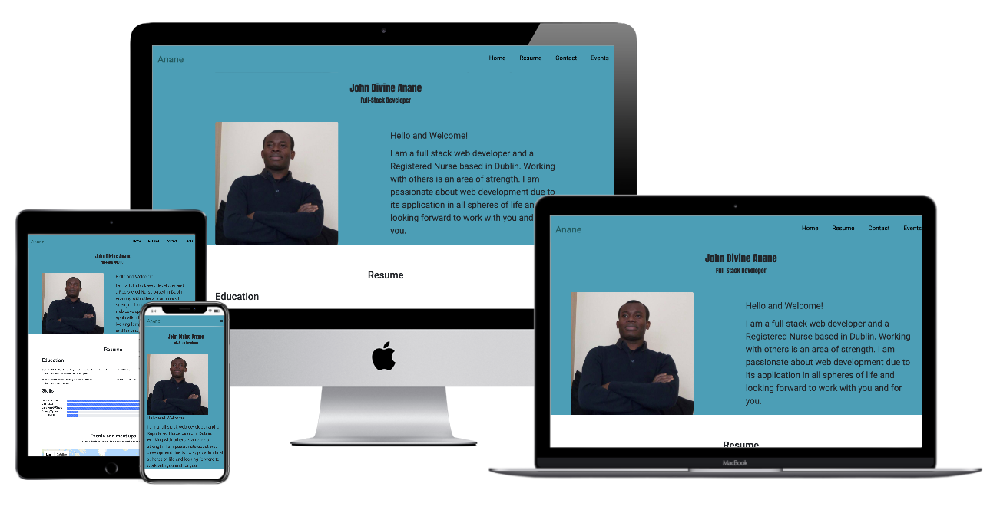

# Anane
## Introduction
This project seeks to exhibit the developers skills in relation to adding interactivity to websites as a second milestone project for the code institute.
The updates to this site which hitherto was a static website include the Google map functionality as well as connecting the contact form to a working email thereby 
making it possible for the developer to be contacted.

## Demo 

Find a live version <a href="http://ami.responsivedesign.is/?url=https://ananejd.github.io/Anane/">here</a>

## UX (User Experience)

### Goal of the project
This project is intended to create an online presence for myself whilest introducing me as a software developer. It is also intended as an avenue to 
reach out to other webdevelopers for collaborations and at the same time to sell out my skills to recruiters for a software developer role. The updates seeks 
to incooporate more interactivity to the website.

### Value to the User

* To enable user exhibit his work as a software developer.
* To enable other developers find the developer for collaborations.
* to enable recruiters access to the developer for interviews.

## Design

#### colour
        
* Colours used for the project include: a shades of green, white and blue; green is the developers favorite colour and the text have been made black in line with default colour for text.
bootstraps default blue colour has been employed as well.
        

#### Typography
        
        Roboto is the main font used for the project. Anton was used for introducing the name of the developer in the first section
        as well as his title. the fall back font for the entire website was Sans Serif.
    

#### Imagery
        
            The image of the developer can be found in the first section of the website. This is to enable collaborators and potential recruiters
            have a fair idea who they are dealing with and to add up to the visual dynamics of the page.

## Wireframe

Figma was used to create the <a href="https://www.figma.com/file/tUdMxotevqwOnKqhA3VbQH/MSP-1?node-id=7%3A2">wireframe</a> for this project with inspiration drawn from 
<a href="https://www.awwwards.com/">Awward's website</a>.
 

## Features

* The website is divided into 6 parts: The navigation bar is the first part of the website. it features the surname of the developer 
  as the logo for the website. 3 navigation buttons are located on the right side of the page.

* The second part introduces the name and role of the developer followed by an image of the 
  developer and a brief introduction.

* The third part shows a brief Resume of the developer as well as his skills in relation to web development.

* the fouth part incoporates the google map showing places the developer parttook in code events.

* The Fifth part is a contact form inviting other developers/recruiters for collaborations/job offers.

* The sixth and final part of the website is the footer which houses two social media icons which act as links
  to the social media pages of the developer.

## Technologies used

### Languages used

* HTML5
* CSS3
* JavaScript

### Frameworks, Libraries and Programs used

1. <a href="https://getbootstrap.com/docs/4.5/getting-started/introduction/">Bootstrap4</a>
1. <a href="https://fontawesome.com/start">Font Awesome</a>
1. <a href="https://fonts.google.com/">Google Fonts</a>
1. <a href="https://git-scm.com/">Git</a></li>
1. <a href="https://github.com/">GitHub</a></li>
1. <a href="https://www.figma.com/files/recent">Figma</a>
1. <a href="https://developers.google.com/maps/documentation/javascript/overview">Google Map API</a>
1. <a href="https://www.emailjs.com">EmailJs</a>

### Testing

*   W3C Markup Validator and W3C CSS validator Services were used to ensure there were no syntax errors in the project.
    JavaScript was checked with JS Hint Validator.
*   The responsiveness of the website was tested intermittently with Google Chrome developer tools during the developer process.
    

### Testing and User Experience

1. Users should be able to navigate to all sections of the page using the navigation menus. A click on the logo (Anane)
    should revert the user to the home page.
2. Users should be able to use the form to contact the developer.
3. Users should be able to link up with the developer using the social media icons located in the footer.

### Anticipated future User Experience 
1. The user will be able to download a PDF copy of the developer's resume in further developments.
2. The user should be able to view the various projects the developer has undertaken in future developments.
3. the user should be able to access a blog on the developers experiences/perspective in future updates.

### Bugs

#### Solved Bugs

1. <strong>Problem</strong>The footer was failing to stretch fully across the page in smaller screens. 
    <strong>Solution:</strong> Z-index property along side the right and left rule were used to solve the problem.

1. <strong>Problem</strong> Navigations menus in the header jammed up on mobile versions of the website  
    <strong>Soution:</strong> This was fixed with media queries and Javascript codes as well as bootstrap framework.

2. <strong>Problem:</strong> The introductory passage located by the profile image jammed up with the image on medium sized screen 
   and less.  
   <strong>Solution:</strong> The above described issue was solved by making the image container fluid.

3. <strong>Problem:</strong> the progress bar and lables in the skill section were not aligned.  
    <strong>Solution:</strong> the progress bar and lables were brought to alignment by increasing the column of 
    the progress bars while decreasing the column of the the labels. the progress bars were then brought to 
    alignment using the CSS padding-top rule.

4. deploying google map api had difficulties in relation to key and billings, same was solved by providing credit card details on googles cloud website.

### Deployment

#### GitHub 

The project was deployed to GitHub Pages using the following steps...

1. Log in to GitHub and locate the GitHub Repository
2. At the top of the Repository (not top of page), locate the "Settings" Button on the menu.
3. Scroll down the Settings page until you locate the "GitHub Pages" Section.
4. Under "Source", click the dropdown called "None" and select "Master Branch".
5. The page will automatically refresh.
6. Scroll back down through the page to locate the now published site link in the "GitHub Pages" section.

### Credits

#### code
The code for the website were largely written by the developer (John Divine Anane) using the Bootstrap4 frame-work to a large extent.
Codes from <a href="https://stackoverflow.com/">Stack Overflow</a> were used to debug navigation bar unintended appearance. 

JavaScript codes were introduced from <a href="https://stackoverflow.com/">Stack Overflow</a> with the help of my mentor, Oluwafemi Omedale 
to solve mobile responsive navigation problems subsequentely resulting in the hamburger button seen on mobile view of the website. 

Dubuging of the image and text jam up of the first section of the website noticed in medium sized screen views as well as 
navigation bar menu issues in mobile devices was resolved with the help of Andrew Sokolic, a software developer.

Inspiration for the map functionality and making the contact form functional were derived from Mutt Rudge's lecture on the code institutes LMS.

#### Content

All content was written by the developer.

Inspiration for the ReadMe.md content was drawn from the Code institutes github page and literature from 
<a href="https://www.makeareadme.com/">link</a>.

#### media

All images were created by the developer.

### Acknowledgements

1. I acknowledge my Mentor, Oluwafemi Omadale for his helpful feedback and support

2. Tutors and Slack community of the Code institute

3. Andrew Sokolic, a friend for his advice and tutelege.